# 🏗️ **Smart Home Multi-Hub Architecture Diagram**

```mermaid
graph TD
    %% Define hubs
    subgraph "Primary Hubs"
        A[Aqara M3<br/>Thread Coordinator<br/>Zigbee Coordinator]
        H[Hue Bridge<br/>Zigbee Coordinator]
        S[SmartThings Hub<br/>Zigbee Coordinator<br/>Thread Border Router]
        Apple[Apple Home<br/>Matter Controller<br/>Thread Border Router]
        HA[Home Assistant<br/>Matter Observer<br/>MQTT Gateway]
    end

    %% Define device categories
    subgraph "Device Types"
        AZ[Aqara Zigbee<br/>Sensors, Switches, Plugs]
        HZ[Hue Zigbee<br/>Bulbs, Lights]
        LZ[Legacy Zigbee<br/>Older Devices]
        MT[Matter Devices<br/>Aqara Sensors,<br/>Switches, Thermostats]
        TH[Thread Devices<br/>Aqara M3/DB,<br/>Border Routers]
        MQ[MQTT Devices<br/>ESPHOME, Custom]
    end

    %% Define networks
    subgraph "Network Fabrics"
        Thread[Thread Network<br/>AqaraHome-73af<br/>Primary Fabric]
        Zigbee[Zigbee Networks<br/>Separate Meshes]
        Matter[Matter Fabric<br/>Cross-Platform]
        MQTT[MQTT Broker<br/>core-mosquitto]
    end

    %% Define border routers
    subgraph "Border Routers"
        ATV[Apple TV<br/>Thread BR]
        HP[HomePods<br/>Thread BR]
        AM3[Aqara M3<br/>Thread BR]
        ADB[Aqara DB<br/>Thread BR]
        STH[SmartThings<br/>Thread BR]
    end

    %% Connections
    A --> AZ
    H --> HZ
    S --> LZ
    Apple --> MT
    Apple --> TH
    HA --> MT
    HA --> MQ

    A --> Thread
    AM3 --> Thread
    ADB --> Thread
    ATV --> Thread
    HP --> Thread
    STH --> Thread

    A --> Zigbee
    H --> Zigbee
    S --> Zigbee

    A --> Matter
    Apple --> Matter
    HA --> Matter

    HA --> MQTT

    %% Styling
    classDef primaryHub fill:#e1f5fe,stroke:#01579b,stroke-width:2px
    classDef device fill:#f3e5f5,stroke:#4a148c,stroke-width:2px
    classDef network fill:#e8f5e8,stroke:#1b5e20,stroke-width:2px
    classDef border fill:#fff3e0,stroke:#e65100,stroke-width:2px

    class A,H,S,Apple,HA primaryHub
    class AZ,HZ,LZ,MT,TH,MQ device
    class Thread,Zigbee,Matter,MQTT network
    class ATV,HP,AM3,ADB,STH border
```

## 📋 **Architecture Key Points**

### **Hub Roles & Responsibilities**
- **Aqara M3**: Primary Thread coordinator, Zigbee coordinator for Aqara devices
- **Hue Bridge**: Dedicated Zigbee coordinator for Hue lighting ecosystem
- **SmartThings**: Legacy Zigbee coordinator, secondary Thread border router
- **Apple Home**: Matter controller, primary Thread border router
- **Home Assistant**: Matter observer, MQTT gateway, system integrator

### **Network Separation**
- **Thread**: AqaraHome-73af fabric (preferred), Apple devices as border routers
- **Zigbee**: Separate meshes per hub (no cross-contamination)
- **Matter**: Cross-platform device control via Apple Home + HA
- **MQTT**: ESPHome and custom device integration

### **Device Placement Rules**
- Aqara Zigbee → Aqara M3 only
- Hue Zigbee → Hue Bridge only
- Legacy Zigbee → SmartThings only
- Matter devices → Apple Home first, HA as observer
- Thread devices → Auto-join nearest border router

### **No Duplication Policy**
- Each device belongs to exactly one hub
- No Zigbee devices in Matter/Thread ecosystems
- No cross-ecosystem entity duplication
- Clean separation prevents conflicts

This diagram provides a visual reference for the multi-hub architecture and device placement rules.